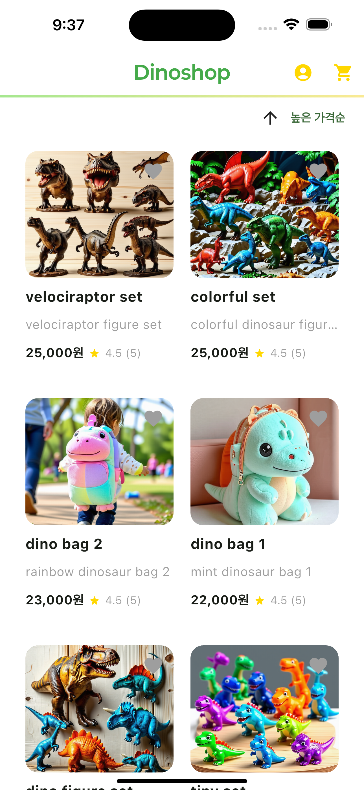
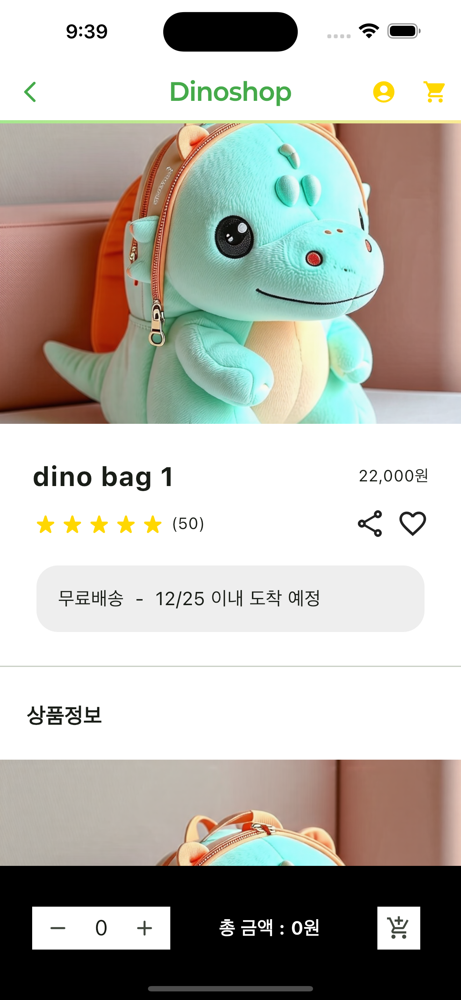
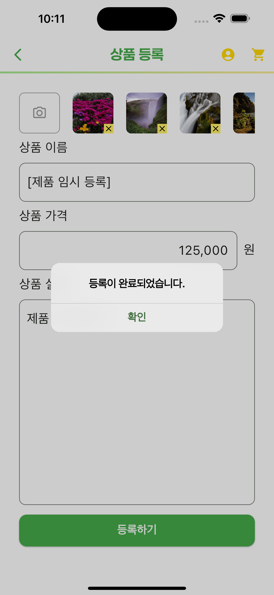
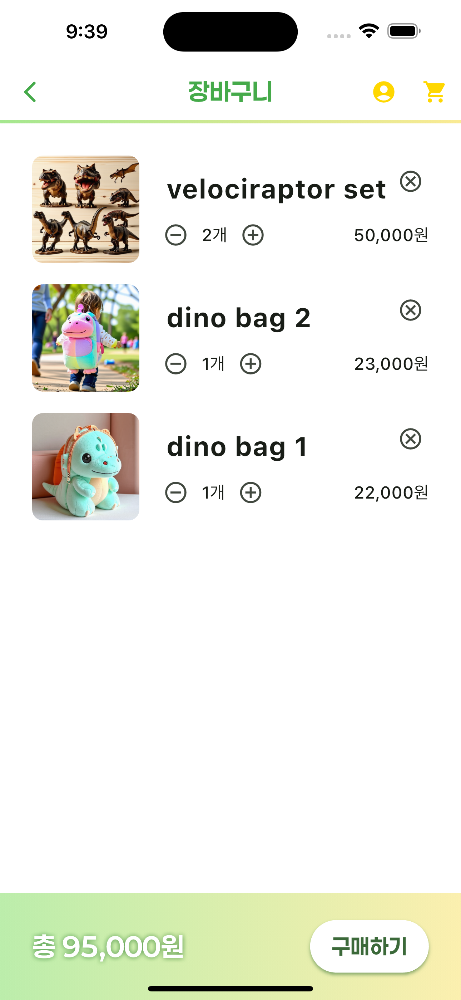

# 🦖 Dinoshop

## 💬 프로젝트 소개

- 공룡에 관련한 제품들을 볼 수 있는 앱 입니다!

## 📌 주요 기능

- 귀여운 공룡 제품들을 볼 수 있어요.
- 가격 순으로 제품들을 정렬할 수 있어요.
- 제품을 누르면 상세 페이지에서 자세한 정보를 확인할 수 있어요.
- 마음에 들었다면 원하는 개수만큼 장바구니에 추가할 수 있어요.
- 장바구니에서는 담았던 제품 목록과 개수를 확인할 수 있어요.
- 장바구니에 담겨있는 모든 제품들의 총 합계를 확인하고 구매할 수 있어요.
- 관리자로 로그인할 경우 제품을 등록할 수 있어요.
- 제품을 등록할 때는 정확한 제품명, 가격, 정보를 기입하고 제품 사진 1장 이상을 추가해야 등록할 수 있어요.
- 제품 가격은 숫자만 입력이 가능해요.

## 👀 샘플 사진

    
    
    
    
    

## 🎥 사용법(앱 실행 예시)

- 유튜브에 올린 시연 영상 추가 예정
